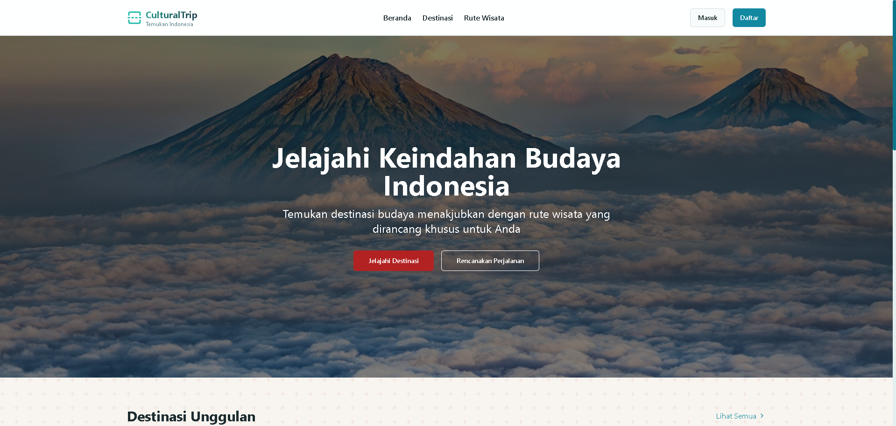
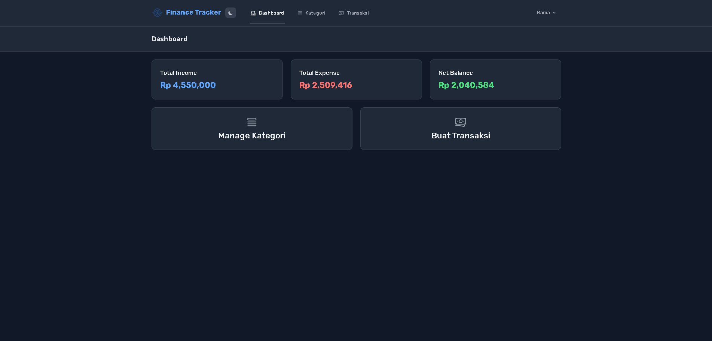
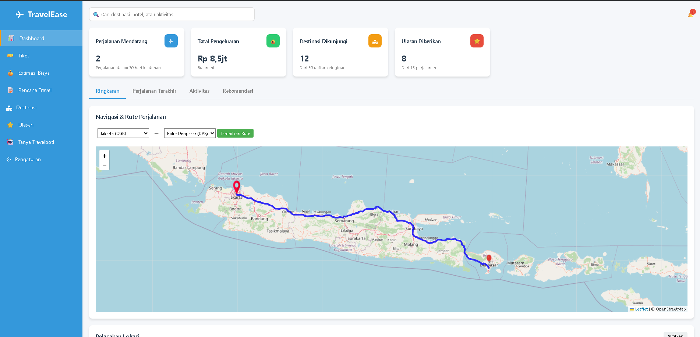
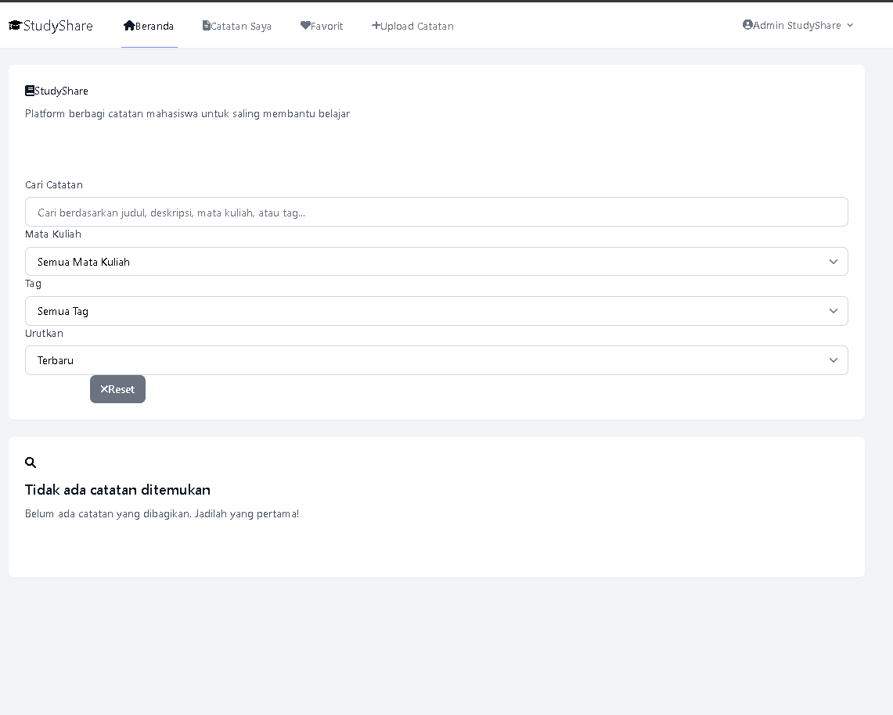
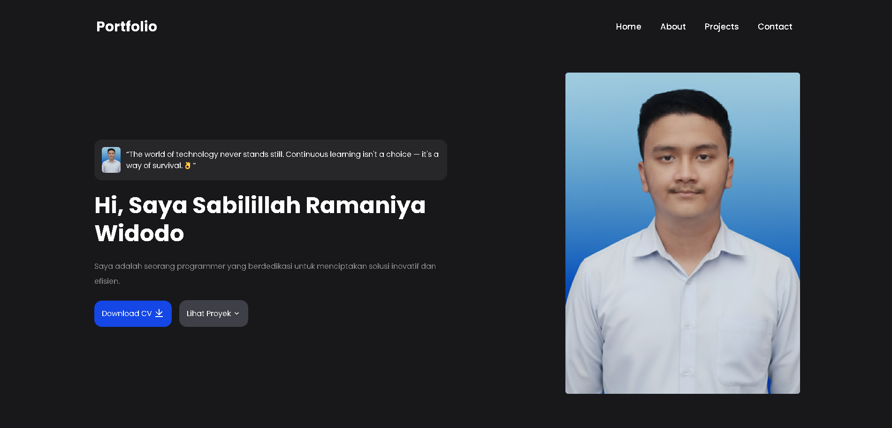
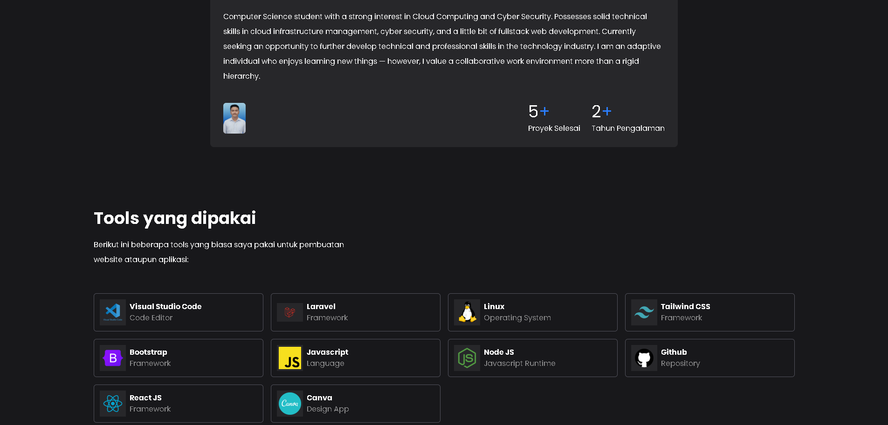
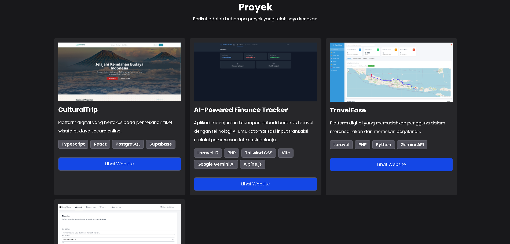

<div align="center">
  
  
  # 👋 Hi, I'm Sabilillah Ramaniya Widodo
  ### Cloud DevOps Engineer & IT Security
  
  [](https://github.com/sblrm)
  [](https://linkedin.com/in/sblrm)
  
  *"It's all about consistency."*
</div>

---

## 🚀 About Me

Saya adalah seorang **Cloud DevOps Engineer** dan **IT Security** yang berdedikasi untuk menciptakan solusi inovatif dan efisien. Dengan pengalaman **2+ tahun** dalam pengembangan web dan desain, saya telah menyelesaikan **5+ proyek** dengan berbagai teknologi modern.

### 🎯 What I Do
- ☁️ **Cloud & DevOps Engineering** – Automating deployments, managing CI/CD pipelines, and orchestrating scalable cloud infrastructures.
- 🔒 **IT Security** – Implementing and maintaining strong security measures to protect systems and data.
- 🤖 **AI Integration** - Implementing AI-powered solutions in web applications
- 📱 **Responsive Design** - Ensuring seamless experience across all devices

---

## 🛠️ Tech Stack

<div align="center">

### Languages & Frameworks


### Styling & Design


### Tools & Environment


</div>

---

## 🎨 Featured Projects

### 🌍 CulturalTrip
> Platform digital yang berfokus pada pemesanan tiket wisata budaya secara online.



**Tech Stack:** TypeScript, React, PostgreSQL, Supabase  
**Features:** Online booking system, cultural tourism management, user authentication

---

### 💰 AI-Powered Finance Tracker
> Aplikasi manajemen keuangan pribadi berbasis Laravel dengan teknologi AI untuk otomatisasi input transaksi melalui pemrosesan foto struk belanja.



**Tech Stack:** Laravel 12, PHP, Tailwind CSS, Vite, Google Gemini AI, Alpine.js  
**Features:** AI-powered receipt scanning, automated transaction input, financial analytics

---

### ✈️ TravelEase
> Platform digital yang memudahkan pengguna dalam merencanakan dan memesan perjalanan.



**Tech Stack:** Laravel, PHP, Python, Gemini API  
**Features:** Travel planning, booking system, AI recommendations

---

### 📚 StudyShare
> Platform digital untuk berbagi dan menemukan materi belajar.



**Tech Stack:** Laravel, TailwindCSS, PHP, Vite  
**Features:** Study material sharing, collaborative learning, user communities

---

## 🎯 Portfolio Website

This portfolio website is built with modern technologies:

- ⚡ **Vite** - Fast build tool and development server
- ⚛️ **React 19** - Latest React with new features
- 🎨 **Tailwind CSS v4** - Utility-first CSS framework
- 🎭 **Remix Icons** - Beautiful icon library
- 📱 **Responsive Design** - Mobile-first approach

### 🚀 Quick Start

```bash
# Clone the repository
git clone https://github.com/sblrm/react-portfolio.git

# Navigate to project directory
cd react-portfolio

# Install dependencies
npm install

# Start development server
npm run dev

# Build for production
npm run build
```

---

## 📱 Screenshots

<div align="center">

### Desktop View


### Mobile View


### Projects Section


</div>

---

## 🎓 Experience & Achievements

- 🏆 **2+ Years** of web development experience
- 🚀 **5+ Successful** projects completed
- 💼 **Full Stack** development expertise
- 🤖 **AI Integration** in web applications
- 📱 **Responsive** design approach

---

## 📞 Let's Connect!

<div align="center">

[](https://sblrm-portfolio.vercel.app)
[](https://linkedin.com/in/sblrm)
[](https://github.com/sblrm)
[](mailto:sabilillah.widodo@binus.ac.id)

</div>

---

<div align="center">

### 💡 "Mari terhubung dan berdiskusi tentang teknologi, proyek, atau peluang kolaborasi!"

⭐ **Don't forget to star this repository if you find it interesting!**


</div>
